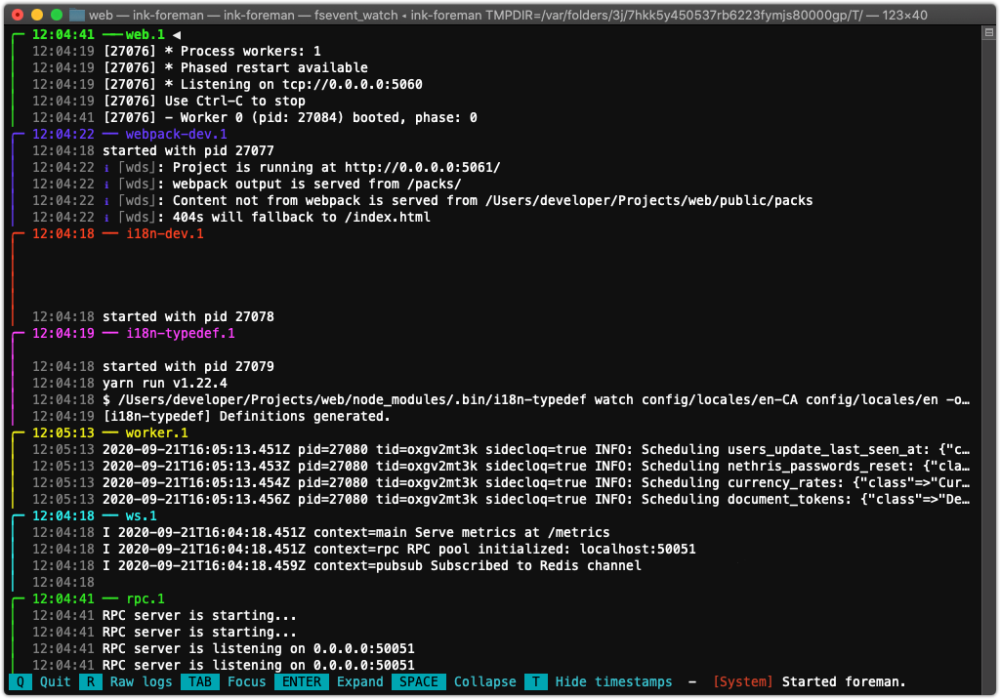

# ink-foreman

An [Ink](https://github.com/vadimdemedes/ink) React terminal application for managing [foreman](https://github.com/ddollar/foreman) logs.




## Install

```bash
$ git clone https://github.com/ericmatte/ink-foreman
$ npm install
$ npm link
```

## CLI

```
$ ink-foreman --help

  Usage
    $ ink-foreman
```

_Note: This app may flicker on some terminals (ie.: iterm2)_
